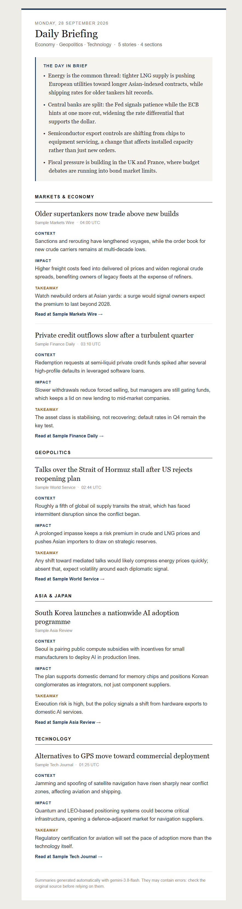

# Daily News Digest

[English](README.md) | **Español**

[](../../actions/workflows/ci.yml)
[](../../actions/workflows/daily_digest.yml)


Boletín diario automatizado de **economía, geopolítica y tecnología**. Lee feeds RSS de
medios internacionales, usa **Google Gemini** para seleccionar y analizar las noticias más
relevantes, y envía un correo HTML con diseño de newsletter. Se ejecuta gratis cada mañana
en **GitHub Actions**.

<p align="center"></p>

## Características

- **6 secciones**: Estados Unidos, Europa, Asia y Japón, Mercados y Economía, Geopolítica y
  Tecnología, con ~30 feeds verificados (FT, BBC, The Economist, Nikkei Asia, SCMP...).
- **Análisis estructurado** por noticia: *Contexto*, *Impacto* económico/geopolítico y
  *Conclusión*, más un bloque inicial **"Lo esencial del día"** que conecta las secciones.
- **Selección por relevancia**: Gemini recibe ~3× candidatos por sección, elige los más
  significativos y descarta duplicados de la misma historia entre medios.
- **Multilenguaje**: `DIGEST_LANGUAGE=es|en|fr|...` controla el idioma del análisis y de la
  plantilla.
- **Tolerante a fallos**: un feed caído o una sección fallida no impiden el envío.
- **Coste cero**: tier gratuito de Gemini (~7 llamadas/día) + GitHub Actions + Gmail SMTP.
- **Modelo de respaldo**: si el modelo principal está saturado (503) o sin cuota diaria (429),
  se usa automáticamente un segundo modelo con cuota independiente.

## Arquitectura

```
                ┌────────────┐     ┌──────────────┐     ┌────────────┐
 RSS feeds ───▶ │ fetcher.py │ ──▶ │ summarizer.py│ ──▶ │ mailer.py  │ ──▶ Gmail
 (~30, en       │ descarga,  │     │ Gemini: 1    │     │ Jinja2 →   │     (SMTP
  paralelo)     │ filtra 24h,│     │ llamada por  │     │ HTML + txt │      587 TLS)
                │ deduplica  │     │ sección + 1  │     │            │
                └────────────┘     │ resumen día  │     └────────────┘
                                   └──────────────┘
                        main.py orquesta · config.py carga .env y feeds
```

| Fichero | Responsabilidad |
|---|---|
| `src/config.py` | Variables de entorno (validadas por modo) y catálogo de feeds por categoría |
| `src/fetcher.py` | Descarga con timeout, parseo con feedparser, filtro temporal, limpieza, deduplicación |
| `src/summarizer.py` | Prompts, llamada a Gemini con salida JSON tipada, reintentos, unión con metadatos RSS |
| `src/mailer.py` | Render HTML/texto y envío SMTP con STARTTLS |
| `src/models.py` | Modelos Pydantic (esquemas del LLM y del boletín) |
| `src/i18n.py` | Etiquetas y fechas localizadas |
| `src/templates/digest.html.j2` | Plantilla del correo (tablas + CSS inline, 600px, responsive) |
| `main.py` | CLI y orquestación del pipeline |

### Decisiones de diseño

- **Salida estructurada en vez de HTML generado por el LLM.** Gemini devuelve JSON validado
  contra un esquema Pydantic (`response_schema`). El HTML lo genera una plantilla propia
  con *autoescape*, así el formato es consistente y el texto del modelo nunca se inyecta
  como HTML.
- **El modelo no puede inventar enlaces.** A Gemini solo se le pide `article_id` + análisis;
  el titular original, la fuente y la URL se recuperan de los datos RSS. IDs desconocidos o
  repetidos se descartan.
- **Una llamada por sección.** Permite que el modelo compare y priorice noticias de varias
  fuentes, cabe holgadamente en los límites gratuitos, y aísla fallos (si una sección falla,
  el resto se envía y el pie del correo lo indica).
- **Reintentos selectivos y modelo de respaldo.** Backoff (tenacity) solo para `5xx` y `429`
  por minuto, respetando el *"retry in Ns"* que sugiere la API. Un `429` de cuota **diaria**
  no se reintenta (solo gastaría peticiones): se marca el modelo como agotado y se pasa al
  de respaldo. Los errores `400/403` fallan rápido.
- **Descarga propia antes de feedparser.** feedparser no permite timeout y algunos medios
  bloquean su User-Agent; se descarga con `urllib` y se parsean los bytes.
- **Fuentes sin fecha.** Nikkei Asia no publica fechas en su RSS: se aceptan entradas sin
  fecha, acotadas por `MAX_PER_FEED` (los feeds van de más nuevo a más antiguo).
- **Configuración sin efectos en import.** `load_settings()` solo exige las variables que
  necesita cada modo, así los tests y `--demo` funcionan sin secretos.

## Puesta en marcha

### 1. Clave de la API de Gemini

1. Entra en [Google AI Studio → API keys](https://aistudio.google.com/apikey).
2. **Create API key** (crea o elige un proyecto de Google Cloud).
3. Cópiala: será `GEMINI_API_KEY`. El tier gratuito es suficiente.

> El modelo por defecto es `gemini-3.8-flash`, con `gemini-3.5-flash-lite` como respaldo.
> En el tier gratuito `gemini-3.8-flash` permite solo **~20 peticiones/día**: un boletín usa 7,
> pero varias pruebas seguidas lo agotan (el respaldo toma el relevo). Consulta tus límites en
> <https://ai.dev/rate-limit> y la lista de modelos en <https://ai.google.dev/gemini-api/docs/models>.

### 2. Contraseña de aplicación de Gmail

Gmail no permite usar tu contraseña normal por SMTP; necesitas una **App Password**:

1. Activa la **verificación en dos pasos**: <https://myaccount.google.com/security>.
2. Ve a <https://myaccount.google.com/apppasswords>.
3. Crea una con un nombre como `news-digest`. Google mostrará 16 caracteres
   (`abcd efgh ijkl mnop`): será `EMAIL_PASSWORD`.

> Si no aparece la opción de App Passwords, la verificación en dos pasos no está activa o tu
> cuenta es de Workspace con esa opción deshabilitada por el administrador.

### 3. Ejecución local

```bash
python -m venv .venv
source .venv/bin/activate          # Windows: .venv\Scripts\activate
pip install -r requirements-dev.txt
cp .env.example .env               # y rellena los valores
```

```bash
python main.py --demo        # renderiza un boletín de ejemplo, sin credenciales
python main.py --fetch-only  # lista los candidatos RSS, sin llamar a Gemini
python main.py --dry-run     # genera el boletín real en output/digest.html, sin enviarlo
python main.py               # ejecución completa: genera y envía el correo
```

### 4. Automatización con GitHub Actions

1. Sube el repositorio a GitHub.
2. En **Settings → Secrets and variables → Actions → Secrets**, crea:

   | Secret | Valor |
   |---|---|
   | `GEMINI_API_KEY` | Tu clave de AI Studio |
   | `EMAIL_SENDER` | Cuenta de Gmail que envía |
   | `EMAIL_PASSWORD` | La App Password de 16 caracteres |
   | `EMAIL_RECEIVER` | Destinatario(s), separados por comas |

3. (Opcional) En la pestaña **Variables**, define `DIGEST_LANGUAGE` (p. ej. `es`),
   `GEMINI_MODEL` o `ARTICLES_PER_CATEGORY`.
4. Pruébalo en **Actions → Daily digest → Run workflow** (marca *dry_run* para generar sin
   enviar; el HTML queda como artefacto descargable de la ejecución).

El workflow se lanza a las **07:30 hora de Madrid todo el año**, para que el correo esté en
la bandeja antes de las 8:00 pese a los retrasos habituales de GitHub.

Como el `cron` de GitHub solo entiende UTC y España cambia de hora, hay dos entradas
(`30 5` para verano UTC+2 y `30 6` para invierno UTC+1). Un job `gate` compara el cron que ha
disparado la ejecución con el desfase actual de `Europe/Madrid` y deja pasar solo el correcto;
el otro aparece como *skipped*. Al comparar con el cron (no con la hora del reloj), un
arranque con retraso nunca provoca un día sin correo ni un correo duplicado.

Para otra hora o zona, cambia los dos `cron` y `LOCAL_TZ` en `.github/workflows/daily_digest.yml`.

> **A tener en cuenta**
> - GitHub puede retrasar las ejecuciones programadas unos minutos en horas de carga.
> - En repositorios públicos, GitHub **desactiva los workflows programados tras 60 días sin
>   actividad** en el repo. Basta con un commit o reactivarlo desde la pestaña Actions.

## Configuración

| Variable | Por defecto | Descripción |
|---|---|---|
| `GEMINI_API_KEY` | — | **Obligatoria** (salvo `--fetch-only` / `--demo`) |
| `EMAIL_SENDER`, `EMAIL_PASSWORD`, `EMAIL_RECEIVER` | — | **Obligatorias** para enviar |
| `GEMINI_MODEL` | `gemini-3.8-flash` | Modelo de Gemini principal |
| `GEMINI_FALLBACK_MODEL` | `gemini-3.5-flash-lite` | Modelo de respaldo (`none` lo desactiva) |
| `DIGEST_LANGUAGE` | `en` | Idioma del análisis y la plantilla (`en`, `es`; otros códigos usan etiquetas en inglés) |
| `LOOKBACK_HOURS` | `24` | Ventana temporal de noticias |
| `ARTICLES_PER_CATEGORY` | `4` | Noticias por sección en el correo |
| `CANDIDATES_PER_CATEGORY` | `3 × ARTICLES` | Candidatos enviados a Gemini por sección |
| `MAX_PER_FEED` | `8` | Entradas máximas leídas de cada feed |

Los feeds se definen en `DEFAULT_FEEDS` (`src/config.py`); añadir una sección nueva es
añadir una clave allí y su etiqueta en `src/i18n.py`.

## Códigos de salida

| Código | Significado |
|---|---|
| `0` | Boletín generado (y enviado) correctamente |
| `1` | Error de configuración, ningún feed disponible o todas las secciones fallaron: **no se envía nada** |
| `2` | Enviado, pero alguna sección falló (el run de Actions aparece en rojo para que lo revises) |

## Tests y calidad

```bash
pytest            # 36 tests; sin red ni secretos (RSS, Gemini y SMTP simulados)
ruff check .      # lint (incluye reglas de seguridad flake8-bandit)
ruff format .     # formato
```

El workflow `ci.yml` ejecuta lint y tests en cada push y pull request.

## Limitaciones

- El análisis se basa en el titular y el resumen del RSS, no en el artículo completo (muchas
  fuentes tienen muro de pago). Algunos feeds (Nikkei Asia) solo ofrecen titulares; el prompt
  instruye al modelo a no inventar detalles en esos casos.
- Reuters eliminó sus feeds RSS públicos en 2020, por lo que no se incluye.
- The Economist publica semanalmente; la mayoría de días aporta pocas noticias en 24 h.
- Los resúmenes los genera un LLM y pueden contener errores: el correo siempre enlaza la
  fuente original.
